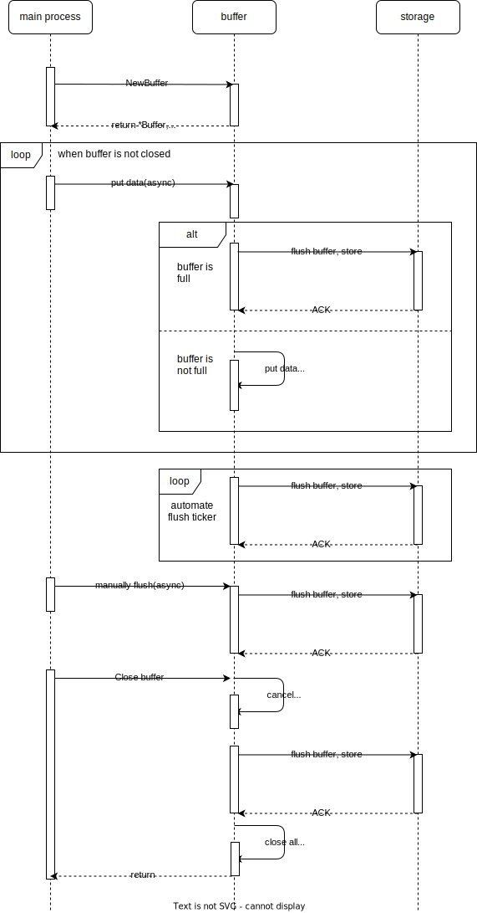

# go-buffer

go-buffer represents a Generic buffer that asynchronously flushes its contents.

## Motivation

Provide generic buffer for user, which is useful for applications that need to aggregate data / write to an external storage before flush it.
Compatible with various data types (Container), providing error handling and secure Close.

## Features

- Periodic automatic flush
- Manually flush
- Safely Close
- Error Channel for error handling
- Generic Support

## Install

```shell
go get github.com/Kevinello/go-buffer@latest
```

### ⚠️ Retracted versions

Versions released **erroneously**, Please do not install these versions([retracted versions](https://go.dev/ref/mod#go-mod-file-retract))

- v0.0.1
- v0.0.2

## Usage



## Project Structure


## TODO

- add test and benchmark

## Contribution & Support

Feel free to send a pull request if you consider there's something which can be improved. Also, please open up an issue if you run into a problem when using benchvisual or just have a question.
